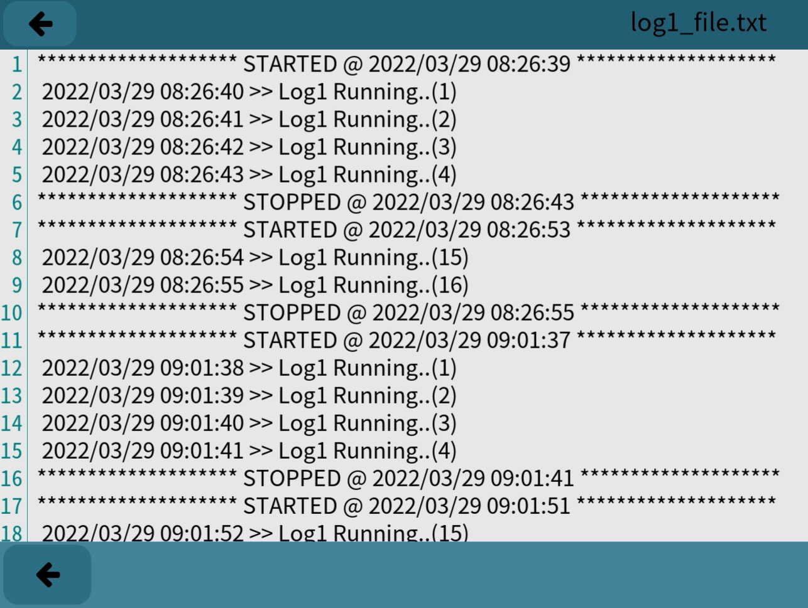

# Loggo

Simple Logger Library with example



# Build example

Go to the project folder ex:
```
cd Download/Loggo-main
```

type
```
make
make run
```

# Usage

Include the library in your project:
```
#include "loggo.h"
```

Declare one or more Loggo instances:
```
Loggo *myLog1 = new Loggo("log1_file.txt");
```

Start a log, otherwise no writing will be done:
```
myLog1->start();
```

Write in the log:
```
myLog1->write("Example text");
```

Write again:
```
myLog1->write("Example text again");
```

Stop the log:
```
myLog1->stop();
```

Close the log file (can be closed without calling stop):
```
myLog1->close();
```

Open again the log file:
```
myLog1->open();
```

Start again:
```
myLog1->start();
```

etc.

Note that it is not necessary to check whether it is possible to write to the log file.
The library also takes care of this aspect, if the log is stopped or if the log file is closed, simply the non applicable commands will be ignored.
For debugging purposes it is possible, for example, to call the write function at any point of the program then calling start you start the debug. 

